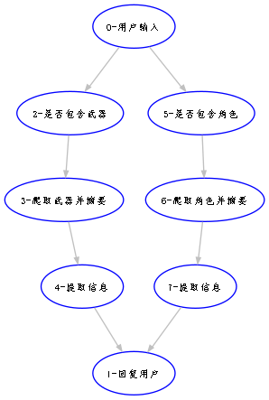

# CyberFlow 大语言模型工作流创建

项目的目的是快速的搭建调试并使用 LLM 的工作流，在短时间内创建一个 LLM 应用程序，快速进行需求验证。
- workflow 和 autoGPT 这类工具的使用场景是有区别的，后者多使用 ReAct 框架来解决开放式问题；
- workflow 也是一种自动化的工具，但是它的使用场景是有限的，主要是用于解决一些流程化的问题，比如问答、推荐、自动化等等；
- 两者都是标准的基于 LLM 的 agent。但是 workflow 在商业化使用的更加广泛。

# 介绍及案例

## 案例一：原神相关问题的问答

### 问题解决的步骤
- 要解决的问题：原神的装备搭配相关问题
- 问题的形式：用户提问，机器回答
- 解答流程示意 
- 整个流程用到的步骤和工具包括：
  - 问题的理解
    - 问题的分类
    - 问题的分词
    - 问题的意图识别
  - 可供调用的 Tools
    - 原神的装备、人物特性的相关数据库，用于数据提取
    - 原神 wiki 的爬虫，用于抓取数据库中不存在的数据

### 示例问题和解答
- 示例问题："我想知道夜兰能不能拿裁叶萃光"
- LLM（基于 GPT-3.5）：根据目前的游戏资料，夜兰是一个弓手角色，而裁叶萃光是一把饰金之刃，适合激化流刻晴等元素战技释放频率较高的角色。由于夜兰是弓手，而裁叶萃光是一把剑类武器，所以夜兰可能无法使用裁叶萃光这把武器。然而，游戏中的角色和武器的搭配可能会有变化，所以具体是否能够给夜兰使用裁叶萃光还需要等待游戏官方的宣布或更新。

## 案例二：生成行业报告（建设调试中）